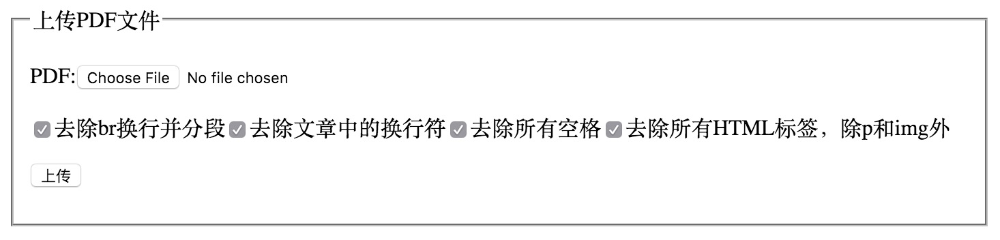

# PDFtoHTML

Demo for : [《Node.js实现PDF文件转HTML》](http://blog.yourtion.com/nodejs-convert-pdf-to-html.html#comments)

convert pdf to html using Node.js

## How to use 

1. Install Poppler (http://poppler.freedesktop.org/)
2. clone this repo `clone https://github.com/yourtion/Demo_PDFtoHTML.git`
3. Install package `npm install`
4. Run `node app.js`

## ScreenShot

 
 

